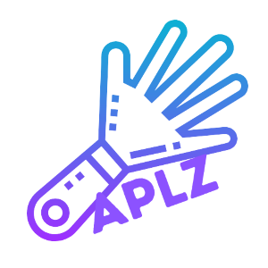

# Applause: Collaborative Technology Integration through MuseScore

## Description

Slow clap, fast clap, who will have the last Clap! Welcome to the Applause plug-in for MuseScore. 

Music is innately a collaborative activity. We work with composers, instruments, and other music makers to create memorable moments, music, and listening opportunties. There are endless tools for digital composition using tracks, samples, midi sounds etc. and most of these have a means of collaborating with other music makers. Users can easily share their work using links and account sharing, and can often collaborate on the same piece of work such as in BandLab where multiple users work simultaneously on a project. However, in the world of formal Western notated composition, a music maker must pay for a Sibelius subscription in order to enjoy that feature. My work has often required me to use a small budget and make choices between technologies for the classroom or physical instruments. I always chose instruments as it allows for a larger number of student participants, reuse from year to year, and they don’t come with a yearly/monthly subsciption fees. Because of this, I am constantly looking to discover free tools for my learners that integrate technology in a meaningful way and keep the musical aspects of collaboration. To date, we have used free notation programs such as MuseScore to learn compositional techniques, practice aural skills, and create our own written music. Learners have always been able to share these by saving the document as a pdf and attaching them to an email/google classroom however, this seems a bit archaic in the modern high-tech world we function in. Applause is in development to bring accessible notation software into a more collaborative age of free technologies. This plug-in, used in conjunction with MuseScore, allows learners and educators to comment on the overall work of 1 to 40+ contributors within the score. Comment types are only limited by the creativity of the writter and can be provided with an unlimited character count. 

This will allow musicians to collaborate and provide feedback to each other from across the room or across the world while having the potential to work as an assessment and feedback tool for educators. Currently, this plugin is only useful while all contributors are synchronous however future versions will expand on this idea. In the spirit of collaboration, it will be available for free (as is MuseScore).


## Building

`make build`

## Running

`make run`

## Confingure

In the `client` folder you'll find a `.env` : 

```
APLZ_SCORENAME="scjNYYbo"
APLZ_PATH="/home/judohippo/aplaz"
APLZ_SERVER_URL="localhost"
APLZ_SERVER_PORT="8080"
```

`APLZ_SCORENAME` : The name of the score you wish edit

`APLZ_PATH` : The path your local aplz cache. Can be anywhere you havea write/read permission

`APLZ_SERVER_URL` : The url of the server

`APLZ_SERVER_PORT` : Port that the server is accessible on.
